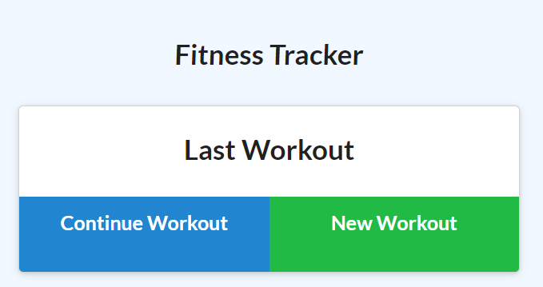
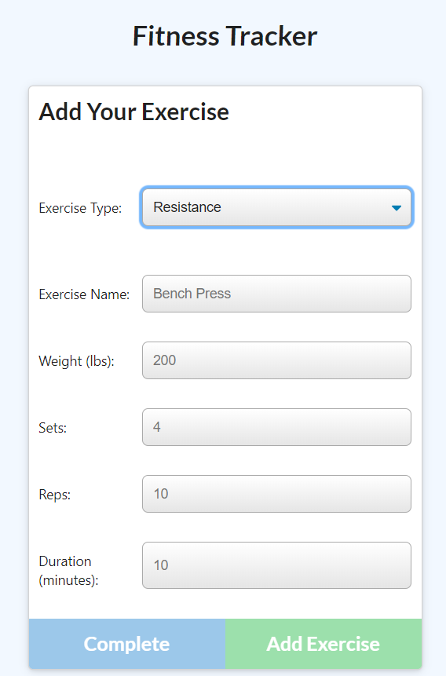

# fitnessTracker

## What it does

* This is an application that allows the user to add their own workouts to a database.

* Upon opening the application the user is taken to the homepage where they can continue workout, or add new workout.

* If the user chooses to add new workout, they will be give options in a dropdown of what type of workout they would like to add.

* If the user has used the application before they can choose continue workout. This will allow them to view the last workout added.

* If the user goes to the dashboard they can view all of the completed workouts

